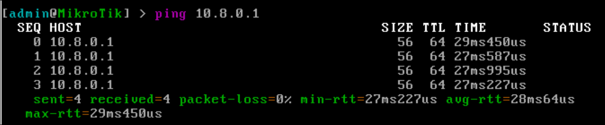

University: [ITMO University](https://itmo.ru/ru/)

Faculty: [FICT](https://fict.itmo.ru)

Course: [Network programming](https://github.com/itmo-ict-faculty/network-programming)

Year: 2025

Group: K3323

Author: Vlasov Aleksandr Alekseevich

Lab: Lab1

Date of create: 28.03.2025

Date of finished:

### Настройка сервера

Создаем прерываемую виртуалку в Яндекс облаке, скачиваем клиент Amnezia, указываем запрашиваемые данные


Протокол -- TCP


После создания пользователя экспортируем конфиг .ovpn

Убираем из конца блок:

```
redirect-gateway def1 ipv6 bypass-dhcp
ifconfig-ipv6 fd15:53b6:dead::2/64  fd15:53b6:dead::1
block-ipv6
```

И из начала:

```
dhcp-option DNS 1.1.1.1
dhcp-option DNS 1.0.0.1
```

Создаем локально виртуалку в VirtualBox


Заходим на выданный адрес в Winbox

В файлах загружаем конфиг


Идем в PPP и импортируем


После включаем интерфейс


Чтобы проверить можно зайти на сервер посмотреть его ip в локальной сети


И пингануть с микротика


