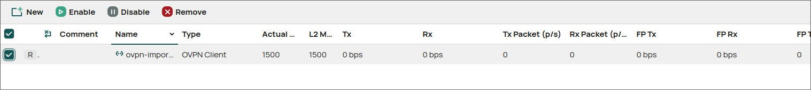
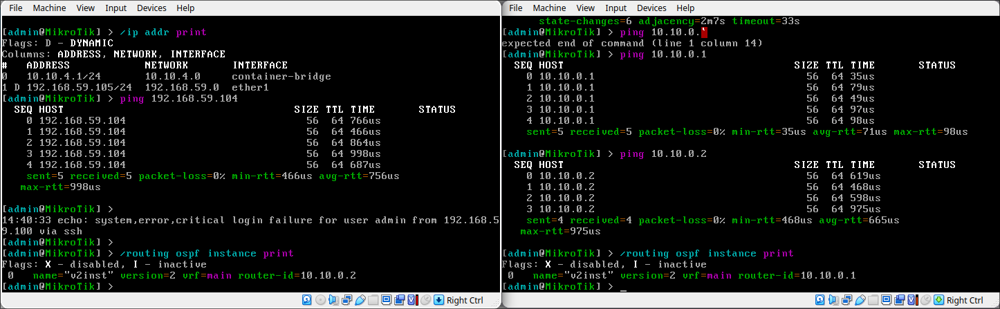
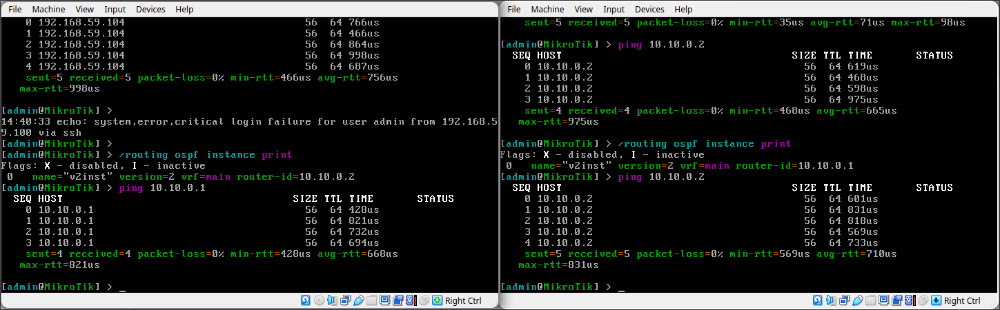

University: [ITMO University](https://itmo.ru/ru/)

Faculty: [FICT](https://fict.itmo.ru)

Course: [Network programming](https://github.com/itmo-ict-faculty/network-programming)

Year: 2025

Group: K3323

Author: Vlasov Aleksandr Alekseevich

Lab: Lab1

Date of create: 07.04.2025

Date of finished:

### OpenVPN

Аналогично предыдущей практической работе импортируем конфиг

### Ansible

Создаем файл инвентори, куда помещаем ip адреса роутеров, дополнительно для каждого роутера создавая переменные с индексом, по которому
можно будет динамически определять ip

Далее создаем плейбук с конфигурацией ntp сервера и ospf.

Копируем оба файла на удаленный сервер по ssh и выполняем `ansible-playbook -i inventory.ini playbook.yaml`

Получаем 2 роутера со сконфигурированным ntp сервером и ospf

