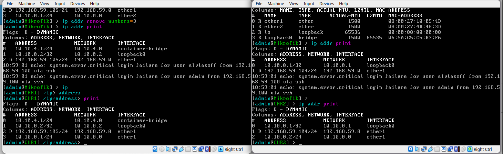
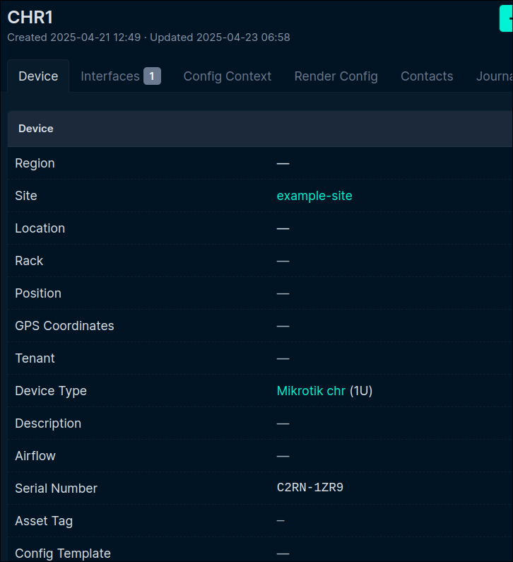

University: [ITMO University](https://itmo.ru/ru/)

Faculty: [FICT](https://fict.itmo.ru)

Course: [Network programming](https://github.com/itmo-ict-faculty/network-programming)

Year: 2025

Group: K3323

Author: Vlasov Aleksandr Alekseevich

Lab: Lab3

Date of create: 22.04.2025

Date of finished:

### Информация в Netbox

Поднимаем Netbox на ВМ, создаем 2 устройства и заполняем информацию

После через плагин nb_lookup получаем информацию о роутерах и сохраняем в файл

### Конфигурирование

Пишем плейбук в котором на основе запрошенных данных из Netbox устанавливаем имя и ip адрес на роутере

Заходим на роутеры, то что нужно поменялось:

### Добавление серийного номера

Пишем еще один плейбук в котором через установку фактов и их получение с помощью hostvars добавляем для каждого роутера серийный номер в netbox

В Netbox смотрим, что поменялось:

