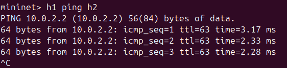
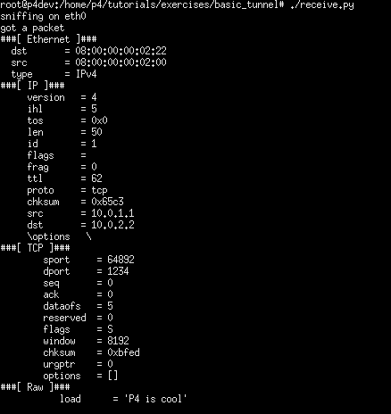
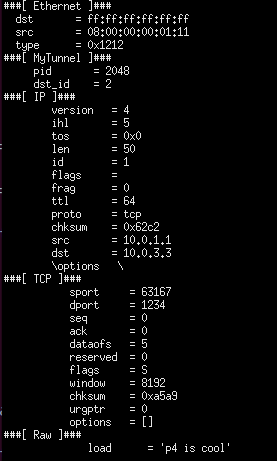

University: [ITMO University](https://itmo.ru/ru/)

Faculty: [FICT](https://fict.itmo.ru)

Course: [Network programming](https://github.com/itmo-ict-faculty/network-programming)

Year: 2025

Group: K3323

Author: Vlasov Aleksandr Alekseevich

Lab: Lab4

Date of create: 03.05.2025

Date of finished:

### Implementing Basic Forwarding

Дописываем логику для парсера, если тип ipv4, то извлекаем заголовки: 

```
state start {
	packet.extract(hdr.ethernet);
	transition select(hdr.ethernet.etherType) {
		TYPE_IPV4: parse_ipv4;
		default: accept;
	}
    }
    state parse_ipv4 {
	packet.extract(hdr.ipv4);
        transition accept;
    }
```

Дописываем логику для ингресс, определяем адреса, убавляем ttl, если адрес валидный то направляем по lpm таблице

```
action drop() {
        mark_to_drop(standard_metadata);
    }

    action ipv4_forward(macAddr_t dstAddr, egressSpec_t port) {
	hdr.ethernet.dstAddr = dstAddr;
	hdr.ethernet.srcAddr = hdr.ethernet.dstAddr;
	standard_metadata.egress_spec = port;
        hdr.ipv4.ttl = hdr.ipv4.ttl - 1;
    }

    table ipv4_lpm {
        key = {
            hdr.ipv4.dstAddr: lpm;
        }
        actions = {
            ipv4_forward;
            drop;
            NoAction;
        }
        size = 1024;
        default_action = NoAction();
    }

    apply {
        if (hdr.ipv4.isValid()) {
	ipv4_lpm.apply();
    }
```

Дописываем логику депарсера, заново собираем пакет, добавляя заголовки бывшие на входе

```
apply {
	packet.emit(hdr.ethernet);
    packet.emit(hdr.ipv4);
    }
```

Пробуем пингануть:



### Implementing Basic Tunneling

Дописываем парсер, чтобы обрабатывал еще и заголовок myTunnel:

```
state parse_myTunnel {
        packet.extract(hdr.myTunnel);
        transition select(hdr.myTunnel.proto_id) {
            TYPE_IPV4: parse_ipv4;
            default: accept;
        }
    }
```

Дописываем таблицу и действие в ингресс, делаем по полному идентификатора получателя:

```
action myTunnel_forward(egressSpec_t port) {
        standard_metadata.egress_spec = port;
    }

    table myTunnel_exact {
        key = {
            hdr.myTunnel.dst_id: exact;
        }
        actions = {
            myTunnel_forward;
            drop;
        }
        size = 1024;
        default_action = drop();
    }

    apply {
        if (hdr.myTunnel.isValid()) {
            myTunnel_exact.apply();
        }

        if (hdr.ipv4.isValid() && !hdr.myTunnel.isValid()) {
            ipv4_lpm.apply();
        }
    }
```

Добавляем в депарсере заголовок myTunnel:

```
packet.emit(hdr.myTunnel);
```

Пробуем отослать сообщение, сначала через ip адрес:



Теперь меняем ip адрес, но добавляем id:


